# React Compiler 介紹

## 自動記憶化的原理

<div class="abs-br m-6 flex gap-2">
  <a href="https://react.dev/learn/react-compiler" target="_blank" alt="React Compiler Docs" title="React Compiler 官方文件"
    class="text-xl slidev-icon-btn opacity-50 !border-none !hover:text-white">
    <carbon-logo-react />
  </a>
</div>

<!--
歡迎大家參加今天的 React Compiler 分享
這個技術將會徹底改變我們寫 React 的方式
-->

---

# 今日議程

<Toc maxDepth="2" columns="2" />

---

# 為什麼需要 React Compiler？

<div class="grid grid-cols-2 gap-8">

<div>

## 現狀問題 😫

<v-clicks>
<ul>
<li>手動記憶化：需要開發者判斷何時使用 <code>useMemo</code>、<code>useCallback</code></li>
<li>心智負擔：記住依賴陣列該放什麼</li>
<li>容易出錯：忘記更新依賴、過度或不足的記憶化</li>
<li>效能問題：不必要的重新渲染影響用戶體驗</li>
</ul>
</v-clicks>

</div>

<div>

## React Compiler 解決方案 ✨

<v-clicks>

- **自動記憶化**：編譯器分析程式碼，自動插入記憶化邏輯
- **Zero Runtime Cost**：編譯時期優化
- **安全性**：遵循 React 純函數規則
- **開發體驗**：無需手動判斷，專注業務邏輯

</v-clicks>

</div>

</div>

<v-click>

<div class="mt-8 p-4 bg-green-50 dark:bg-green-900/20 rounded-lg border-l-4 border-green-500">
  <strong>核心價值</strong>：讓開發者回歸專注於業務邏輯，而不是效能優化
</div>

</v-click>

<!--
首先我們來看看為什麼需要 React Compiler
左邊是我們目前面臨的問題，右邊是 React Compiler 提供的解決方案
-->

---

# 什麼情況下會被編譯？

<div class="grid grid-cols-2 gap-6">

<div>

###### ✅ 會被記憶化

<v-clicks>

- 純函數組件
- 沒有副作用的計算
- 符合 React Rules of Hooks
- 可預測的資料流

</v-clicks>

```tsx {all|2-3|5-9|all} {maxHeight:'300px'}
function ProductCard({ product }) {
  const discountPrice = product.price * 0.8;
  const isExpensive = discountPrice > 1000;

  return (
    <div>
      <h3>{product.name}</h3>
      <span className={isExpensive ? "expensive" : "affordable"}>
        ${discountPrice}
      </span>
    </div>
  );
}
```

</div>

<div>

###### ❌ 不會被編譯

<v-clicks>

- 包含副作用的程式碼
- 違反 React Rules
- 動態 Hook 調用
- 使用 ref.current 賦值

</v-clicks>

```tsx {all|3|6-8|all} {maxHeight:'300px'}
function ProblematicComponent({ items }) {
  // 副作用：直接操作 DOM
  document.title = `共 ${items.length} 項目`;

  // 違反規則：條件性 Hook
  if (items.length > 0) {
    const [selected, setSelected] = useState(null);
  }

  return <div>...</div>;
}
```

</div>

</div>

<!--
這頁很重要，展示了編譯器的智慧判斷邏輯
左邊的例子會被自動記憶化，右邊的不會
-->

---

# 運作原理

```mermaid {theme: 'neutral', scale: 0.8}
graph LR
    A[源程式碼] --> B[React Compiler]
    B --> C[優化後程式碼]
    C --> D[Babel JSX Transform]
    D --> E[最終程式碼]


    style B fill:#61DAFB
    style C fill:#98FB98
```

<div class="flex flex-col items-center">



</div>

## 關鍵技術點

<v-clicks>

1. **AST 分析優先**：React Compiler 必須在 JSX 轉換**之前**執行
2. **依賴關係追蹤**：自動分析變數依賴關係
3. **智慧判斷**：只在有效能提升的地方插入記憶化

</v-clicks>

<v-click>

```javascript
// babel.config.js
module.exports = {
  plugins: [
    ["babel-plugin-react-compiler"], // 必須在前面
    ["@babel/plugin-transform-react-jsx"],
  ],
};
```

</v-click>

<!--
這裡解釋編譯器的核心工作原理
特別強調 AST 分析必須在 JSX 轉換之前進行
-->

---

# 編譯前後對比

````md magic-move {lines: true}
```tsx {*|2-3|*}
// 編譯前
function App({ user }) {
  const avatar = user.avatar || "/default.png";

  return (
    <div>
      
      <p>{user.name}</user>
    </div>
  );
}
```

```tsx {*|2-3|*} {maxHeight:'250px'}
// 編譯後
import { c as _c } from "react/compiler-runtime";
function App(t0) {
  const $ = _c(2);
  const { user } = t0;
  const avatar = user.avatar || "/default.png";
  let t1;
  if ($[0] !== avatar) {
    t1 = (
      <div>
        
      </div>
    );
    $[0] = avatar;
    $[1] = t1;
  } else {
    t1 = $[1];
  }
  return t1;
}
```
````

<!--
這個 magic-move 效果可以清楚展示編譯前後的差異
讓大家看到編譯器實際做了什麼
-->

---

# Live Demo 時間！ 🚀

<!--
這裡是 Live Demo 時間
-->

---

# 效能問題範例

```tsx {all|4-6|8-9|11|all}
function ShoppingApp() {
  const [items, setItems] = useState(LARGE_ITEM_LIST); // 1000+ 項目
  const [filter, setFilter] = useState("");

  // 每次 render 都重新計算 - 效能殺手！
  const filteredItems = items.filter((item) =>
    item.name.toLowerCase().includes(filter.toLowerCase())
  );

  const expensiveItems = filteredItems.filter((item) => item.price > 100);
  const totalPrice = expensiveItems.reduce((sum, item) => sum + item.price, 0);

  return (
    <div>
      <input
        value={filter}
        onChange={(e) => setFilter(e.target.value)}
        placeholder="搜尋商品..."
      />
      <div>昂貴商品總價: ${totalPrice}</div>
      {filteredItems.map((item) => (
        <ItemCard key={item.id} item={item} />
      ))}
    </div>
  );
}
```

<!--
這是一個典型的效能問題例子
每次輸入都會觸發大量重新計算
-->

---

# 啟用 React Compiler 後

<div class="grid grid-cols-1 gap-6">

<div>

## 自動優化結果

<v-clicks>

- ✅ `filteredItems` 自動記憶化
- ✅ `expensiveItems` 自動記憶化
- ✅ `totalPrice` 自動記憶化
- ✅ ItemCard 避免不必要重渲染

</v-clicks>

</div>

<div>

</div>

</div>

<v-click>

<div class="mt-6 p-4 bg-green-50 dark:bg-green-900/20 rounded-lg border-l-4 border-green-500">
  <strong>重點</strong>：開發者不需要修改任何程式碼，編譯器自動處理所有優化
</div>

</v-click>

<!--
展示啟用 React Compiler 後的改善效果
重點是開發者不需要改程式碼
-->

---

# React Compiler Playground

<div class="text-center mb-6">
  <a href="https://playground.react.dev/" target="_blank" class="text-blue-500 hover:text-blue-700 text-lg">
    🔗 playground.react.dev
  </a>
</div>

```tsx {all|2|4-8|10-14|all}
function UserProfile({ user, showDetails }) {
  const displayName = user.firstName + " " + user.lastName;

  if (!showDetails) {
    return <div>{displayName}</div>;
  }

  const profileData = {
    name: displayName,
    email: user.email,
    joinDate: new Date(user.createdAt).toLocaleDateString(),
  };

  return (
    <div>
      <h2>{profileData.name}</h2>
      <p>{profileData.email}</p>
      <small>加入日期: {profileData.joinDate}</small>
    </div>
  );
}
```

<v-click>
  <div class="p-3 bg-blue-50 dark:bg-blue-900/20 rounded">
    <strong>觀察重點</strong>：編譯器只在 <code>showDetails=true</code> 時記憶化 <code>profileData</code>
  </div>
</v-click>

<!--
介紹 Playground 的使用
展示編譯器如何智慧處理條件渲染
-->

---

# 除錯技巧

<div class="grid grid-cols-2 gap-6">

<div>

## 如何確認程式碼有被編譯？

<v-clicks>

**方法 1：console.log**

```tsx
function MyComponent() {
  console.log("trigger");
  const result = expensiveCalculation();
  return <div>{result}</div>;
}
```

**方法 2：React DevTools Profiler**

- 對比 re-render 次數變化
- 觀察 render 時間改善

</v-clicks>

</div>

<div>

## 處理編譯失敗

<v-clicks>

**常見問題**：

- ESLint 規則衝突
- 手動記憶化與編譯器衝突
- 第三方庫相容性問題

**解決策略**：

- 信任編譯器，移除手動記憶化
- 更新 ESLint 規則
- 明確標示副作用

</v-clicks>

</div>

</div>

<!--
提供實用的除錯技巧
幫助開發者解決實際遇到的問題
-->

---

# 團隊導入策略

<v-clicks>

- **環境設定**：安裝相關套件和工具
- **ESLint 更新**：安裝並配置 `eslint-plugin-react-compiler`

```bash
npm install -D babel-plugin-react-compiler@rc
npm install -D eslint-plugin-react-compiler
npx react-compiler-healthcheck@latest
```

- **react 19 以前的版本**：需要另外安裝

```bash
npm i react-compiler-runtime@19.0.0-beta-63e3235-20250105
```

```javascript
// .eslintrc.js
module.exports = {
  plugins: ["react-compiler"],
  rules: {
    "react-compiler/react-compiler": "error",
  },
};
```

</v-clicks>

<!--
開始介紹團隊導入策略
第一週主要是準備工作
-->

---

# 漸進式導入步驟

````md magic-move
```javascript
// 方式一：以 Babel overrides 依資料夾逐步導入
// babel.config.js
module.exports = {
  plugins: [
    // 全域插件（若有）
  ],
  overrides: [
    {
      test: "./src/modern/**/*.{js,jsx,ts,tsx}",
      plugins: ["babel-plugin-react-compiler"],
    },
  ],
};
```

```javascript
// 擴大覆蓋範圍與分流 legacy 設定
// babel.config.js
module.exports = {
  plugins: [
    // 全域插件（若有）
  ],
  overrides: [
    {
      test: [
        "./src/modern/**/*.{js,jsx,ts,tsx}",
        "./src/features/**/*.{js,jsx,ts,tsx}",
      ],
      plugins: ["babel-plugin-react-compiler"],
    },
    {
      test: "./src/legacy/**/*.{js,jsx,ts,tsx}",
      plugins: [
        // legacy 專用設定（若需要）
      ],
    },
  ],
};
```

```javascript
// 方式二：以註解模式逐步 opt-in（"use memo" / "use no memo"）
// babel.config.js
module.exports = {
  plugins: [
    [
      "babel-plugin-react-compiler",
      {
        compilationMode: "annotation",
      },
    ],
  ],
};

// 在元件或自訂 Hook 開頭加入指令
function TodoList({ todos }) {
  "use memo"; // 僅此元件被編譯
  const sorted = todos.slice().sort();
  return (
    <ul>
      {sorted.map((t) => (
        <li key={t.id}>{t.text}</li>
      ))}
    </ul>
  );
}
```

```javascript
// 方式三：以 runtime gating 做 feature flag 控管 / A/B 測試
// babel.config.js
module.exports = {
  plugins: [
    [
      "babel-plugin-react-compiler",
      {
        gating: {
          source: "ReactCompilerFeatureFlags",
          importSpecifierName: "isCompilerEnabled",
        },
      },
    ],
  ],
};

// ReactCompilerFeatureFlags.js
export function isCompilerEnabled() {
  return getFeatureFlag("react-compiler-enabled");
}
```
````

<!--
展示漸進式導入的三個階段
每個階段都有具體的配置示例
-->

---

# 常見遷移問題

<div class="grid grid-cols-2 gap-6">

<div>

## 問題 1：記憶化衝突

```tsx {all|1,3-5|9-11|all}
// ❌ 衝突情況
const MyComponent = React.memo(({ data }) => {
  const processedData = useMemo(() => {
    return expensiveProcess(data);
  }, [data]);

  return <div>{processedData}</div>;
});

// ✅ 解決方案
const MyComponent = ({ data }) => {
  const processedData = expensiveProcess(data);
  return <div>{processedData}</div>;
};
```

</div>

<div>

## 問題 2：第三方庫相容性

```tsx {all|3-4|8-10|all}
// ❌ 隱藏的副作用
function MyComponent() {
  const chart = useChart(data);
  chart.update(); // 副作用！
  return <canvas ref={chart.canvasRef} />;
}

// ✅ 明確標示副作用
function MyComponent() {
  const chart = useChart(data);
  useEffect(() => {
    chart.update();
  }, [chart, data]);
  return <canvas ref={chart.canvasRef} />;
}
```

</div>

</div>

<!--
展示兩個最常見的遷移問題
提供具體的解決方案
-->

---

# Q&A 時間 🙋‍♂️

準備好常見問題的解答了！

---

# 常見問題 FAQ

<div class="grid grid-cols-2 gap-8">

<div>

## Q1: 學習成本如何？

<v-click>

**A:**

- **開發者**：幾乎零學習成本
- **團隊**：主要是工具鏈更新
- **時間**：2-4 週完成導入

</v-click>

</div>

<div>

## Q2: 會有副作用嗎？

<v-click>

**A:**

- 編譯器非常保守，確保安全才優化
- 可能問題：第三方庫相容性
- 建議：漸進式導入，充分測試

</v-click>

</div>

<div>

## Q3: TypeScript 支援？

<v-click>

**A:**

- 完全支援 TypeScript
- 型別推導不受影響
- 編譯後程式碼保持型別安全

</v-click>

</div>

</div>

<!--
準備好的常見問題解答
涵蓋團隊最關心的幾個面向
-->

---

# 後續資源

<div class="grid grid-cols-2 gap-8">

<div>

## 📚 官方資源

- [React Compiler 官方文件](https://react.dev/learn/react-compiler)
- [Compiler Playground](https://playground.react.dev/)
- [GitHub Repository](https://github.com/facebook/react/tree/main/compiler)
- [Blog](https://github.com/reactwg/react-compiler/discussions)

</div>

<div>

## 📚 學習資源

- [How React Compiler Performs on Real Code](https://www.developerway.com/posts/how-react-compiler-performs-on-real-code)
- [React Compiler Design Goals](https://github.com/facebook/react/blob/main/compiler/docs/DESIGN_GOALS.md)
- [React Compiler internals](https://www.youtube.com/watch?v=Pw8w2O5Y0no)
- [React Compiler Deep Dive](https://www.youtube.com/watch?v=uA_PVyZP7AI)

</div>

</div>

<!--
提供完整的後續資源
包含檢查清單幫助實際導入
-->

---

# 感謝聆聽

<div class="abs-br m-6 flex gap-2">
  <a href="https://react.dev/learn/react-compiler" target="_blank" alt="React Compiler Docs"
    class="text-xl slidev-icon-btn opacity-50 !border-none !hover:text-white">
    <carbon-logo-react />
  </a>
</div>

<!--
結束頁面，感謝大家的參與
期待後續的討論和交流
-->
